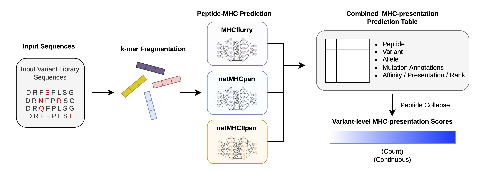

# ImmunoScreen

ImmunoScreen is a configurable workflow for screening high-throughput protein
sequence libraries for predicted MHC presentation. It fragments each protein
into peptide windows, runs established MHC predictors, maps predictions back to
the source variants and produces annotated peptide-level tables suitable for
variant scoring and mutation-effect analysis.

The workflow is not restricted to a particular protein, organism or variable
region. Users provide their own sequence library and define the relevant
columns, peptide lengths, sequence region, MHC alleles, thresholds and
predictor installations in YAML.

Two pipelines are maintained separately:

- **MHC-I:** fragmentation → MHCflurry and netMHCpan → combine and annotate
- **MHC-II:** fragmentation → netMHCIIpan → annotate

The included AAV VR4 and VR6 configurations demonstrate the expected setup.
VR6 is used as the worked example below.

## Overview



## Repository layout

```text
configs/       Example pipeline configurations
src/           Reusable workflow implementation
scripts/       Complete-pipeline and individual-stage commands
analysis/      Variant scoring and mutation-analysis commands
tests/         Tests that do not require the external DTU predictors
data/input/    Local sequence libraries, excluded from version control
data/output/   Generated predictions and analyses, excluded from version control
tools/         Local predictor installations, excluded from version control
```

## Requirements

- Conda or Mamba
- MHCflurry for MHC-I predictions
- netMHCpan 4.2 for the MHC-I workflow
- netMHCIIpan 4.3 for the MHC-II workflow

NetMHCpan and netMHCIIpan are licensed separately by DTU and must be obtained
and installed by each user. Their executables and data are not distributed in
this repository.

## Installation

Create and activate the environment:

```bash
mamba env create -f environment.yml
mamba activate AAV
```

Download the MHCflurry model data:

```bash
mhcflurry-downloads fetch
```

Install the DTU predictors locally. The example configs expect:

```text
tools/netMHCpan-4.2/netMHCpan
tools/netMHCIIpan-4.3/netMHCIIpan
```

Other locations are supported. Set `netmhcpan.executable` in an MHC-I config or
`netmhciipan.executable` in an MHC-II config to the actual executable path.

## Prepare a sequence library

For a tabular high-throughput library, each row should represent one protein
variant. At minimum, the workflow needs:

| Field | Purpose |
| --- | --- |
| Variant ID | A non-empty identifier that is unique within the library. |
| Protein sequence | The amino-acid sequence from which peptide windows are generated. |

Additional columns, such as experimental group, design class or selection
criteria, can be retained as metadata.

A simple CSV could look like:

```csv
variant_id,aa_sequence,design_group
variant_001,MKT...,control
variant_002,MKT...,designed
```

Column names are not fixed. Point the configuration at them using:

```yaml
fragmentation:
  input_type: csv
  input: data/input/libraries/my_library.csv
  sequence_column: aa_sequence
  variant_id_column: variant_id
  metadata_columns:
    - design_group
```

For MHC-I annotation, use the same library and columns under `combine`. For
MHC-II annotation, use them under `annotate`. See the
[input guide](data/input/README.md) for the schemas used by the included
examples.

## Configure a new screen

Start by copying the example closest to the intended analysis:

```bash
cp configs/vr6_k9.yaml configs/my_library_mhci.yaml
cp configs/vr6_k15_netmhciipan.yaml configs/my_library_mhcii.yaml
```

Then edit the copied YAML. The important controls are:

- `run.tag`: short name used in output directories;
- `run.output_root`: parent directory for generated results;
- `fragmentation.input`: sequence-library path;
- `fragmentation.sequence_column` and `variant_id_column`: input schema;
- `fragmentation.metadata_columns`: optional columns retained in mappings;
- `fragmentation.kmers`: peptide length or lengths;
- `fragmentation.variable_region`: coordinates and filtering behavior;
- `mhc.alleles`: alleles in each predictor's required notation;
- predictor thresholds and executable paths; and
- annotation library columns, variable-region coordinates and WT sequence.

Coordinates are 1-based and inclusive. With `mode: overlap`, a peptide is kept
when any part overlaps the configured region. With `mode: contained`, the
entire peptide must fall inside it.

### MHC-I allele notation

MHCflurry and netMHCpan use different allele strings, so each biological allele
has a common output name and one value for each predictor:

```yaml
mhc:
  alleles:
    - name: H2-Db
      mhcflurry: H2-D*b
      netmhcpan: H-2-Db
```

Add or replace entries to match the intended screen. Confirm that every allele
is supported by the installed predictor versions.

### MHC-II allele notation

MHC-II configs require the NetMHCIIpan representation:

```yaml
mhc:
  alleles:
    - name: H2-IAb
      netmhciipan: H-2-IAb
```

## Run an MHC-I screen

```bash
python scripts/run_pipeline.py --config configs/my_library_mhci.yaml
```

The pipeline writes:

```text
data/output/
├── fragmentation/<run-tag>__k<length>/
│   ├── all_fragments.tsv
│   ├── unique_peptides.tsv
│   └── peptide_variant_map.tsv
├── mhcflurry/<run-tag>__k<length>/
│   └── predictions_mapped.tsv
├── netmhcpan/<run-tag>__k<length>/
│   └── predictions_mapped.tsv
└── combined/<run-tag>__k<length>/
    └── combined_annotated.tsv
```

The final table includes peptide and variant identifiers, window coordinates,
allele, predictor scores, threshold flags, variable-region sequence and
mutation annotations.

## Run an MHC-II screen

```bash
python scripts/run_mhcii_pipeline.py --config configs/my_library_mhcii.yaml
```

The pipeline writes:

```text
data/output/
├── fragmentation/<run-tag>__k<length>/
├── netmhciipan/<run-tag>__k<length>/
│   └── predictions_mapped.tsv
└── netmhciipan_annotated/<run-tag>__k<length>/
    └── predictions_mapped_annotated.tsv
```

The annotated table includes the predicted binding core, EL score, EL rank,
binder flag, source-variant mapping and mutation annotations.

## Optional WT-relative analysis

To quantify changes relative to WT, run the same predictor workflow for a
matching WT sequence. The variant and WT configs must use identical peptide
lengths, region coordinates and alleles. Give the WT run a different tag so it
has a separate output directory.

The analysis commands match variant and WT windows by allele and coordinates,
then produce one variant-level score table per allele. See the
[analysis guide](analysis/README.md) for absolute and WT-relative scoring
commands, supported score columns and the mutation framework.

## Run individual stages

Stages can be disabled with their `enabled` setting when a previous output
already exists. The expected upstream file must remain at the configured output
location. Individual-stage examples are documented in
[scripts/README.md](scripts/README.md).

## Citations

If you use ImmunoScreen, cite the prediction methods used in your analysis:

- O'Donnell, T. J., Rubinsteyn, A. and Laserson, U. (2020). MHCflurry 2.0:
  Improved pan-allele prediction of MHC class I-presented peptides by
  incorporating antigen processing. *Cell Systems*, 11, 42–48.e7.
- Nilsson, J. B., Greenbaum, J., Peters, B. and Nielsen, M. (2025).
  NetMHCpan-4.2: Improved prediction of CD8+ epitopes by use of transfer
  learning and structural features. *Frontiers in Immunology*, 16, 1616113.
  [doi:10.3389/fimmu.2025.1616113](https://doi.org/10.3389/fimmu.2025.1616113)

NetMHCpan and NetMHCIIpan are separately licensed DTU software and are not
distributed with this repository.

## Licence

ImmunoScreen is released under the terms in [LICENSE](LICENSE).
